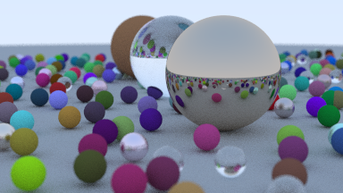
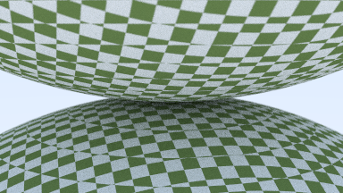
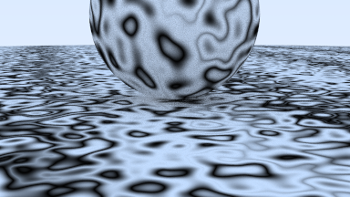
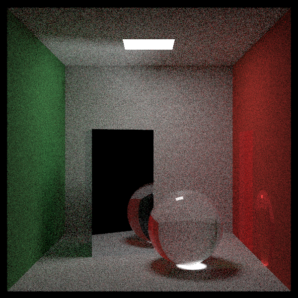

# ray_trace
Learning Rust by writing a ray tracer following [Ray Tracing in a Weekend](http://www.realtimerendering.com/raytracing/Ray%20Tracing%20in%20a%20Weekend.pdf)

## Usage
```ray_trace [output-name]```

## Current results






